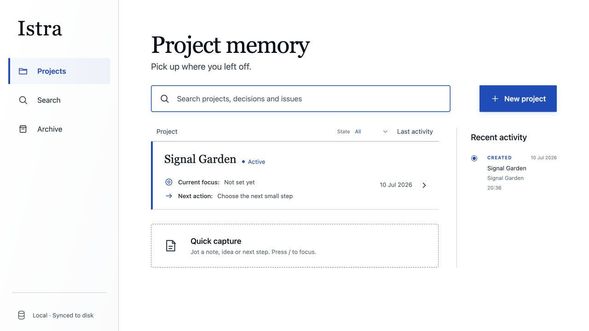
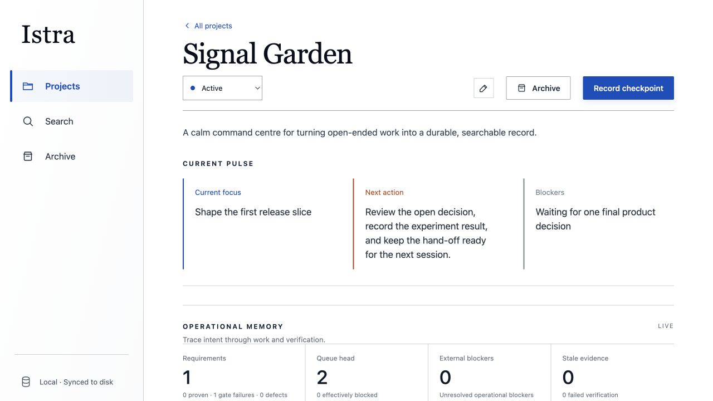
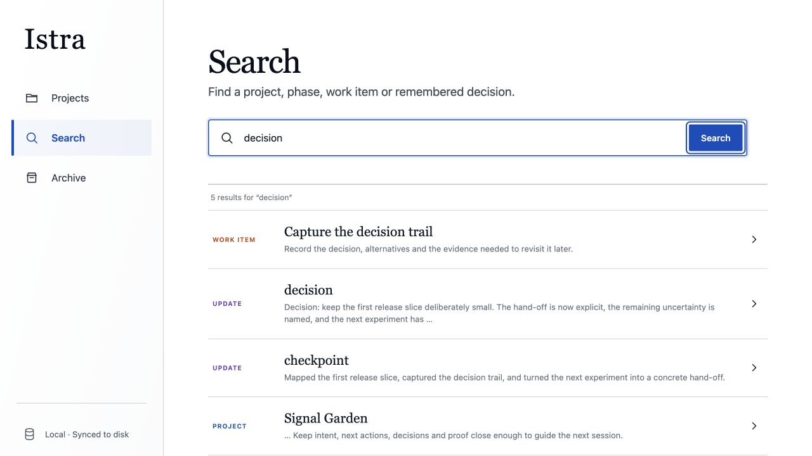
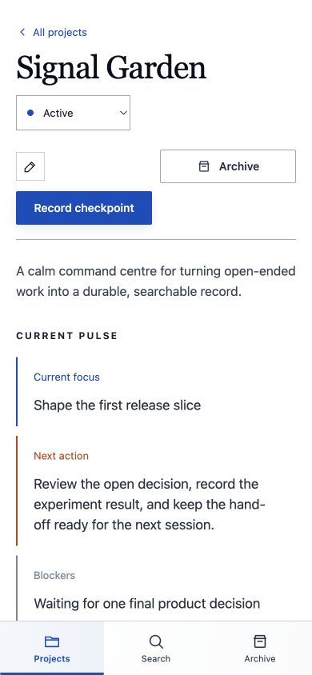

# Istra

> Durable project memory for the work between the plan and the proof.

Istra is a local-first command centre for open-ended work. It keeps the current pulse visible, turns decisions and next actions into a searchable journal, and connects requirements to work, runs, evidence and checkpoints so the next session can start with context instead of archaeology.

<p align="center">
  
  
</p>
<p align="center"><sub>A focused dashboard for the whole portfolio, then a deep project view for the work that matters today.</sub></p>

<p align="center">
  
  
</p>
<p align="center"><sub>Search the whole memory, and keep the hand-off usable when the screen gets small.</sub></p>

## Why Istra

Most tools capture tasks. Istra captures continuity.

- **Current pulse** — Keep focus, next action and blockers visible at the top of every project.
- **Operational memory** — Trace intent through requirements, work queues, external blockers, runs and evidence.
- **Durable journal** — Record progress, decisions, discoveries and checkpoints with revision history.
- **Searchable by default** — Find a project, phase, work item or remembered decision without reconstructing the story.
- **Local and calm** — SQLite, loopback-only HTTP, portable exports and backups; no accounts, remote sync or collaboration layer required.
- **Agent-ready** — Use the same application service from the web UI, MCP, Codex and OpenCode.

Istra is designed for the moment after the meeting, the interrupted investigation or the half-finished build: the important thing is not only what exists, but why it exists, what was proved, and what should happen next.

## Requirements

- Node.js 24 LTS or Node.js 26 (Istra uses the built-in `node:sqlite` module)
- pnpm 11.11.0

The repository's `.nvmrc`, package metadata, container image and CI all use the Node.js 24 compatibility baseline.

## Run locally

```bash
pnpm install
pnpm dev
```

The development UI runs at `http://127.0.0.1:5173` and proxies `/api/v1` to the local Fastify server on port `4317`.

For a production-style local build:

```bash
pnpm build
pnpm start
```

The production server serves both the UI and API at `http://127.0.0.1:4317`.

## Run with Docker Compose

Docker Compose provides a hardened, reproducible single-user deployment:

```bash
cp .env.example .env
docker compose up --build --detach --wait
```

Open `http://127.0.0.1:4317`. The service runs as a non-root user, publishes only on host loopback, persists the database and backups in separate named volumes, and exposes liveness and SQLite readiness checks.

Compose is an isolated app deployment, not the default development topology. Host-run Codex and OpenCode plugins cannot share its named-volume database, and the unauthenticated API must not be exposed to a LAN or the internet. Do not run more than one Istra container against the same SQLite database.

See [Operating Istra](docs/operations.md) for configuration, upgrades, logs, off-volume backups and restore steps.

## Data and backups

The default database path is platform-specific:

- macOS: `~/Library/Application Support/Istra/istra.sqlite3`
- Linux: `${XDG_DATA_HOME:-~/.local/share}/istra/istra.sqlite3`
- Windows: `%LOCALAPPDATA%\Istra\istra.sqlite3`

Set `ISTRA_DATA_DIR` to keep the database elsewhere and `ISTRA_BACKUP_DIR` to separate its snapshots. Istra enables foreign keys, WAL mode and full synchronous durability, takes daily and weekly online snapshots before the first write, and creates dedicated snapshots before migrations and imports.

Use the Data management view for a portable, versioned JSON export or a full replacement import. Import validates the bundle before changing active data and takes a pre-import backup. Import is intentionally not a merge operation.

The authoritative ledger starts at migration v1 and adds the global error-report inbox in v2. Existing databases with the matching v1 history upgrade automatically after a pre-migration backup; incompatible legacy histories still fail closed and are never deleted automatically. Istra exports format v4, accepts v3 and v4 imports, and treats a v3 import as a full replacement with an empty error inbox.

## MCP

The stdio MCP server uses the same application service and database as the UI:

```bash
pnpm mcp
```

For a project-scoped Codex configuration, add the following to `.codex/config.toml`, replacing the path with this checkout's absolute path:

```toml
[mcp_servers.istra]
command = "pnpm"
args = ["--dir", "/absolute/path/to/Istra", "mcp"]
required = false
default_tools_approval_mode = "writes"
```

MCP provides read/search and non-destructive create, edit and archive tools. `report_error` records a bounded, sanitised report of a perceived Istra MCP, plugin, instruction, or workflow fault; it is not for bugs in the user’s project. Istra deliberately does not expose hard deletion, import or backup restoration.

## Codex plugin

The installable plugin source lives in `plugins/istra`. It packages the stdio MCP server, the `istra-project-memory` skill, and the implicitly triggered `istra-error-reporting` skill. The latter tells agents when to report Istra faults autonomously, safely, and without blocking the user’s task.

Build the self-contained plugin runtime with:

```bash
pnpm build:plugin
```

The resulting `plugins/istra/dist/mcp/stdio.mjs` needs Node.js 24 or newer at runtime, but does not depend on this checkout's `node_modules`. Its `.mcp.json` uses the same platform data directory and `ISTRA_DATA_DIR` override as the web application, so the plugin does not create a second data path.

## OpenCode plugin

The same `plugins/istra` directory is an npm package named `opencode-istra`. Once published, install it globally with:

```bash
opencode plugin opencode-istra --global
```

The OpenCode entrypoint adds the bundled local `istra` MCP server and matching operational project-memory instructions. It preserves a pre-existing `mcp.istra` configuration, and uses the same default data directory and `ISTRA_DATA_DIR` override as the application.

For local development before publishing, add the absolute `plugins/istra` path to the `plugin` array in `opencode.json`:

```json
{
  "plugin": ["/absolute/path/to/Istra/plugins/istra"]
}
```

## Commands

```bash
pnpm dev            # API and Vite development servers
pnpm build          # server, web and packaged plugin builds
pnpm build:app      # server and web build without rebuilding plugin artefacts
pnpm build:plugin   # self-contained MCP runtime and OpenCode server package
pnpm start          # production-style loopback server
pnpm migrate        # open the database and apply pending migrations
pnpm mcp            # stdio MCP server from source
pnpm typecheck      # browser and server TypeScript checks
pnpm test           # unit and integration tests
pnpm check          # typecheck, tests and all production builds
pnpm test:plugin    # verify the packaged Codex and OpenCode plugins
pnpm test:e2e       # Playwright browser journeys
```

## Architecture

- `src/domain` contains shared contracts and validation schemas.
- `src/application` contains the use-case service and persistence port.
- `src/infrastructure/sqlite` contains migrations, repositories, search, imports and backups.
- `src/adapters/http` and `src/adapters/mcp` expose the same application service.
- `src/web` contains the React application.

Native HTTP listeners bind to loopback by default. The container listens internally on all interfaces but Compose publishes it only on host loopback. Browser mutations require JSON and reject foreign Host and Origin values. There are no accounts, remote synchronisation or collaboration features in v1.

## Licence

Istra is licensed under the [MIT License](LICENSE).
