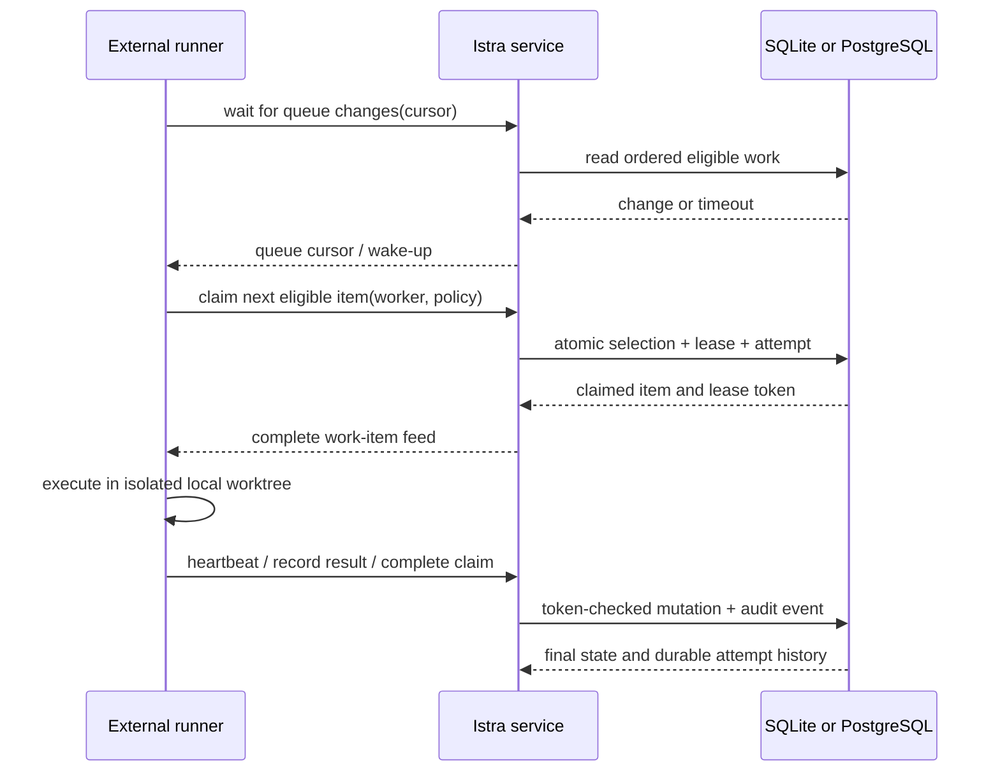

# Agent queue automation plan

## Summary

Extend Istra with a small, storage-backed automation coordination layer so an
external coding runner can efficiently and safely process opted-in work from an
Istra queue. The runner remains responsible for executing code in a local
checkout; Istra remains the local-first source of truth for eligibility,
ownership, audit history, and operator control.

The first integration target is `agent-workshop watch`, which currently polls a
queue, chooses a ranked item client-side, claims it through a generic
optimistic work-item update, and maintains a local recovery journal. This plan
moves the cross-process coordination into Istra while retaining the runner's
local journal for worktree recovery.

## Goals

- Allow an opted-in runner to atomically reserve the next eligible `issue` or
  `task` from one queue.
- Make ownership recoverable after a runner crash through expiring leases and
  explicit heartbeats.
- Provide a durable, cursor-based queue change feed so runners do not need to
  repeatedly fetch every operational work item.
- Record automation attempts, verification outcome, delivery metadata, and
  final work-item state with idempotent, auditable operations.
- Make automation visible and controllable in the Istra UI without allowing
  Istra to run arbitrary commands or hold repository credentials.
- Preserve identical semantics and migration safety for SQLite and PostgreSQL,
  as well as HTTP, MCP, packaged Codex, and OpenCode clients.

## Non-goals

- Istra does not execute shell commands, invoke coding agents, create Git
  branches, push commits, open pull requests, or read repository secrets.
- This does not introduce cloud sync, multi-user collaboration, remote
  webhooks, or a hosted job scheduler.
- A queue remains a deliberate opt-in boundary. A work item outside an enabled
  queue is never eligible merely because its kind is `issue` or `task`.
- The first release does not require parallel workers. The lease model prepares
  for it without changing the single-user product premise.

## Product model



### New domain entities

Add three first-class concepts. They are deliberately narrow and do not encode
agent prompts, credentials, or shell commands.

1. **Queue automation policy** — attached to a work queue and disabled by
   default. It declares whether automated claiming is enabled, eligible item
   kinds, maximum active claims, lease duration, and whether a completed
   delivery requires manual approval before resolution.
2. **Work lease** — a time-limited reservation of one work item by one named
   worker. It has an opaque token, owner identity, acquired/heartbeat/expiry
   times, and a terminal release reason. A lease is not a new work-item status:
   the existing item remains `in_progress` while leased.
3. **Automation attempt** — an immutable identity tied to a work item and
   lease, with append-only observations for progress, verification, delivery
   and notes. Terminal outcome and end time derive from the lease's single
   token-checked terminal transition. This preserves the attempt ordinal and
   audit history without mutating an allegedly immutable record.

Use explicit `automation_*` names in contracts and tables. Do not overload
`Run`, `Evidence`, or `ActivityEvent`: those remain generic proof and audit
records and can be linked from an attempt.

### Eligibility

An item is eligible only when all of the following are true at claim time:

- its project is `active`;
- it belongs to the requested queue;
- that queue's automation policy is enabled;
- its kind appears in the policy's allowed kinds (initially `issue` and
  `task`);
- its status is `open`, or it is an expired lease owned by the same worker and
  valid recovery policy permits reclaiming it;
- it is not effectively blocked by work relations or an unresolved external
  blocker; and
- it wins the existing queue rank ordering, with a stable ID tie-breaker.

Human changes always win. A completion or heartbeat whose lease token is no
longer current returns a typed outcome and must not mutate the work item.

## Public operations

### Claim the next item

Expose one atomic operation rather than asking every runner to page, sort, and
patch a work item independently:

```ts
claimNextAutomatedWork({
  projectId,
  queueId,
  workerId,
  allowedKinds: ["issue", "task"],
  leaseSeconds,
  idempotencyKey,
})
```

`allowedKinds` and `leaseSeconds` are optional caller constraints. They may
only narrow the stored queue policy: allowed kinds are intersected and the
shorter lease duration wins. A caller can never broaden an operator policy.

It returns one of:

- `{ outcome: "claimed", item, lease, attempt, feed }`;
- `{ outcome: "empty", cursor }` when no eligible work exists; or
- `{ outcome: "policy_disabled" | "project_paused" | "capacity_reached", ... }`.

The returned feed must contain the selected item, current requirement links,
blocking context, relevant updates/checkpoint, and a queue cursor. This avoids
a race-prone second lookup and makes the claim response sufficient to begin
work.

### Maintain and complete a lease

Add token-checked operations:

```ts
heartbeatAutomatedWork({ leaseId, leaseToken, idempotencyKey })
recordAutomationAttempt({ leaseId, leaseToken, attempt, run?, evidence?, delivery?, idempotencyKey })
completeAutomatedWork({ leaseId, leaseToken, outcome, expectedWorkItemVersion, idempotencyKey })
releaseAutomatedWork({ leaseId, leaseToken, reason, idempotencyKey })
```

Runner release always requires the current lease token and accepts only
`runner_shutdown` or `abandoned`. Manual operator release is a separate local
web-control operation and is deliberately absent from the runner-facing MCP
surface; it requires the lease version currently shown to the operator so a
stale control cannot release a newly changed lease.

Each operation has its own result union. Heartbeat returns `heartbeat` or a
guard outcome; attempt recording returns `recorded` or `lease_lost`; completion
returns `resolved`, `awaiting_approval`, `retryable`, `blocked`, `interrupted`
or a guard outcome; release returns `released`, `already_released` or
`lease_lost`. Guard outcomes are `lease_lost`, `human_changed_state`,
`project_paused`, and `policy_disabled`. Completion performs its work-item and
terminal lease transition atomically.

The normal accepted-delivery path accepts structured Git data:

```ts
{
  repositoryPath: string,
  integrationBranch: string,
  commitSha: string,
  commitMessage: string,
  artefactUri?: string,
}
```

It records the reference only; it never inspects the repository or verifies a
remote.

### Observe queue changes

Provide a bounded, pull-friendly change feed:

```ts
waitForQueueChanges({ projectId, queueId, cursor?, timeoutSeconds? })
```

The response includes a versioned, project- and queue-scoped opaque cursor and
a compact list of changes that could affect eligibility: queue policy edits,
work-item create/update, rank moves, work relations, external blockers, project
state, and lease expiry/release. Durable changes are returned in bounded pages
without advancing past undispatched rows. A timeout returns no fabricated
change, but the opaque cursor may advance its lease-expiry watermark.

For HTTP, implement this first as long-polling; a later UI enhancement may use
SSE backed by the same cursor contract. For stdio MCP, the runner repeatedly
calls the bounded long-poll tool. Do not add push callbacks from Istra to an
arbitrary URL.

The runner must still call `claimNextAutomatedWork` after every wake-up. Events
are wake-up hints, not authority to execute a stale item.

## Storage and service implementation

### Domain and application layer

- Extend `src/domain/contracts.ts` with Zod schemas and types for automation
  policy, lease, attempt, delivery, claim responses, and typed terminal
  outcomes.
- Add dedicated operations to `src/application/ports.ts` and
  `src/application/istra-service.ts`; do not expose them through the generic
  `updateWorkItem` path.
- Keep `CreateWorkQueueSchema` compatible. Add a separate create/update policy
  operation so existing queues remain automation-disabled after migration.
- Validate bounded lengths, worker IDs, lease durations, result excerpts,
  URLs/artefact URIs, and idempotency keys before storage.
- Reuse the existing provenance and idempotency model. Identical retries return
  the same claim/complete result; a changed payload under the same key fails.

### Persistence

Add equivalent SQLite and PostgreSQL migrations for:

- `work_queue_automation_policies`;
- `work_leases` with a unique active lease per work item;
- `automation_attempts` with a unique `(work_item_id, ordinal)`;
- append-only `automation_attempt_observations` linked to attempts;
- indexed queue-change sequence data, or a projection over `activity_events`
  with a durable monotonic sequence; and
- optional structured delivery columns or a normalised
  `automation_deliveries` table.

Implement the atomic claim in each operational repository, not in the adapter:

- SQLite: one immediate write transaction selects the ranked eligible item,
  checks policy and capacity, writes the lease/attempt, updates the item to
  `in_progress`, and appends the activity event.
- PostgreSQL: use the existing project graph locking strategy plus a
  transaction and row-level locking to guarantee equivalent ordering and
  exclusion.

Both backends must enforce lease-token comparison and expiry at write time.
Expiry must be derived from the stored timestamp, not a runner-provided clock.
Migration defaults keep every existing queue disabled and make no existing
`in_progress` item leased.

### Adapters and packages

- Add HTTP routes under `/api/v1/projects/:projectId/work-queues/:queueId/`
  for policy, wait, claim, and lease actions.
- Register matching, narrowly described MCP tools in
  `src/adapters/mcp/server.ts`. All mutating tools require `client` and an
  idempotency key.
- HTTP automation mutations require bounded `x-istra-client` and
  `Idempotency-Key` headers without truncation. HTTP wait queries coerce the
  bounded numeric timeout before entering the application layer.
- Regenerate the self-contained Codex/OpenCode package and update its
  allowlisted project-memory instructions only after the server contracts are
  stable.
- Update the web API client/types and add an Automation section to the queue
  view: enable/disable policy, active lease, last attempt, lease expiry, and a
  clearly labelled release action.

## Safety and operator controls

- New policies are disabled by default. Enabling requires an explicit UI or MCP
  mutation and is recorded in the activity history.
- Runner mutations require a stable client name plus an idempotency key. The
  lease token is the runner capability; client provenance is an audit and
  idempotency namespace, not a substitute for token validation.
- Require a stable, operator-visible `workerId`; do not use a PID or hostname
  as the only identity.
- Cap initial leases at 90 minutes and long-poll requests at 60 seconds.
- A paused project stops claims and automated completion state changes but
  still accepts bounded attempt observations and explicit lease release. It
  preserves the lease record for inspection or expiry.
- A human work-item edit which changes status, queue, rank, or block state
  invalidates the lease for completion. The caller receives the fresh item and
  `human_changed_state` rather than a generic conflict string.
- Manual approval policies turn an accepted delivery into
  `awaiting_approval`; only a human can resolve it. The runner may retain a
  delivery reference but cannot auto-resolve the item.
- Istra stores no VCS token, remote URL credential, command, prompt, or source
  diff. The external runner remains responsible for secret handling and local
  worktree cleanup.

## Delivery phases

### Phase 0 — Contract invariants

Fix the cross-backend rules before exposing runner operations:

- queue policy is authoritative and disabled by default;
- attempts have immutable identity plus append-only observations;
- pause blocks automated state acceptance, not audit capture or release;
- project-wide external blockers block every queue claim;
- PostgreSQL eligibility writers and claims share one project graph lock;
- the durable queue-change sequence is a rebuildable projection and is not
  copied in portable exports; and
- the opaque cursor carries both the durable sequence and the last expiry
  check, so stored lease timestamps can wake a runner without a scheduler.

**Acceptance proof**

- Both backends return the same typed outcomes and completion mappings.
- A human state, rank, queue, relation, blocker or project change cannot race
  an automated claim or completion.
- Lease tokens never appear in activity records, operator read models, or
  portable exports.
- A v3 or v4 import produces disabled policies and no active automation state.

### Phase 1 — Durable leasing and atomic dequeue

Implement policy, lease, attempt, and `claimNextAutomatedWork` across both
backends and adapters. Ship the queue UI with policy disabled by default.

**Acceptance proof**

- Two concurrent callers can never claim the same item.
- Blocked, disabled, paused, wrong-kind, and lower-ranked items are not
  claimable.
- An expired lease is recoverable according to policy, while a live lease is
  not.
- SQLite/PostgreSQL contract tests yield equivalent claim/lease results.

### Phase 2 — Completion and delivery ledger

Implement heartbeat, immutable attempts, token-checked completion/release, and
structured Git delivery. Link existing generic runs/evidence where supplied.

**Acceptance proof**

- Retry of an idempotent completion returns the original result.
- A lost token or human change cannot overwrite the newer state.
- Resolved, awaiting-approval, blocked, retryable, and interrupted outcomes
  produce correct work-item state and activity history.
- Run and evidence links retain existing proof/staleness semantics.

### Phase 3 — Cursor-based queue feed

Implement the durable change cursor and bounded long-poll endpoint/tool. Add a
small queue activity view in the UI and document the wake-up semantics.

**Acceptance proof**

- A runner starting from an old cursor receives all eligibility-affecting
  changes in order.
- A timed-out wait returns without a spurious change.
- Restart, lease expiry, and policy disable events wake an observer.
- The feed works identically through HTTP and the packaged MCP runtime.

### Phase 4 — Agent-workshop adoption

Replace client-side queue pagination, rank selection, optimistic generic claim,
and fixed sleep in `agent-workshop watch` with claim-next, heartbeat,
record-attempt, completion, and cursor wait calls. Keep the local journal for
uncommitted worktree recovery.

Phase 4 is an external consumer gate, not part of the Istra implementation
release. Do not adopt or enable the feed-backed watcher until the repaired Istra
contracts are committed and released, both storage backends pass the shared
contract suite, the packaged MCP schema is rebuilt and verified, and
`agent-workshop` pins that released surface in its own change.

**Acceptance proof**

- An empty queue blocks on the Istra change feed rather than polling every 15
  seconds.
- A new eligible item is claimed once, its attempt is visible in Istra, and the
  integration commit is recorded structurally.
- Killing and restarting the runner preserves safe recovery without duplicate
  delivery.
- A human can pause the project, disable policy, or change the item and prevent
  unsafe automatic completion.

## Test strategy

- Unit-test schemas, eligibility, cursor encoding, lease expiry, token
  comparison, and all typed result states.
- Add repository behaviour tests in both SQLite and PostgreSQL for atomic
  dequeuing, concurrent claim, policy capacity, recovery, human races,
  idempotency, and migration defaults.
- Extend HTTP and MCP contract tests to lock the public schema, required
  idempotency fields, and error/result shapes.
- Extend packaged-plugin tests so the new MCP tools are actually discoverable
  and callable in the built runtime.
- Add UI tests for disabled-by-default policy and operator-visible active
  leases.
- Add an end-to-end `agent-workshop` smoke test using a temporary Istra store
  and an isolated Git fixture. It must prove one delivery and one recovery
  path without network access.

Run `pnpm check`, the PostgreSQL contract suite, plugin-package tests, and the
agent-workshop integration test before each phase is considered proven.

## Rollout and compatibility

1. Release Phase 1 with every queue disabled and no runner behaviour change.
2. Exercise it in a disposable local project using a visible test queue.
3. Release Phase 2 and inspect attempt/history correctness under forced
   restarts.
4. Release Phase 3, retain the old polling watcher behind a compatibility flag,
   and compare its observed work against the feed-backed watcher.
5. Make the feed-backed integration the default only after both SQLite and
   PostgreSQL prove equivalent behaviour.

Exports/imports must include the new records and preserve foreign-key order.
Older exports import with no automation policies, leases, attempts, or cursor
data. Portable v5 exports omit automation idempotency responses, invalidate
unreleased lease tokens, and restore those leases expired so an import never
transfers live runner ownership.

## Open decisions

- Should a policy's allowed kinds be fixed to `issue`/`task` for the first
  release, or configurable from day one? Recommendation: fixed service
  enforcement with configurable values only after the first contract suite.
- Should failed attempts automatically block an item after a configured limit?
  Recommendation: record a retryable outcome and let the runner propose the
  transition; do not make Istra infer a coding failure from a lease count.
- Should manual approval be a new work-item status or a policy/attempt state?
  Recommendation: keep the existing status set stable initially and represent
  it as a lease/attempt terminal state plus an `in_progress` item with a clear
  UI marker; introduce a work-item status only if the broader product needs it.
- Should long-poll use `activity_events` directly or a materialised queue
  change table? Recommendation: start with a materialised, indexed projection
  because cursor semantics must be compact, queue-scoped, and durable across
  pruning or future activity-event changes.
